<div align="center">


# Healthcare Triage Agent

**Autonomous multi-agent AI system for real-time clinical triage**

<p>
  <a href="https://github.com/Sreethesh007/HackathonAiAgent/actions/workflows/ci.yml">
    
  </a>
  <a href="https://github.com/Sreethesh007/HackathonAiAgent/actions/workflows/frontend-ci.yml">
    
  </a>
  
  
  
  
  
</p>

<p>
  
  
  
  
</p>

> Six specialised LLM agents. One seamless pipeline. Real-time SSE streaming.
> From symptom description to clinician-reviewed recommendation — in seconds.

</div>

---

## 📋 Table of Contents

- [✨ Overview](#-overview)
- [🏗️ Architecture](#️-architecture)
  - [System Architecture](#system-architecture)
  - [Agent Pipeline](#agent-pipeline)
  - [Data Flow](#data-flow)
  - [Frontend Structure](#frontend-structure)
- [🛠️ Tech Stack](#️-tech-stack)
- [📁 Repository Structure](#-repository-structure)
- [🚀 Setup Instructions](#-setup-instructions)
  - [Prerequisites](#prerequisites)
  - [Backend](#backend-local-development)
  - [Frontend](#frontend-local-development)
  - [Docker Compose](#full-stack-with-docker-compose)
  - [Local Models (llama.cpp)](#local-models-with-llamacpp)
- [⚙️ Environment Variables](#️-environment-variables)
- [📖 Usage](#-usage)
  - [Seeding the Knowledge Base](#seeding-the-knowledge-base)
  - [API Endpoints](#api-endpoints)
  - [Example API Calls](#example-api-calls)
  - [Demo Scenarios](#demo-scenarios)
- [🧪 Testing](#-testing)
- [🔄 CI/CD](#-cicd)
- [☁️ Deployment](#️-deployment)
- [📊 Observability](#-observability)
- [🔒 Security](#-security)
- [🔧 Troubleshooting](#-troubleshooting)
- [🤝 Contributing](#-contributing)

---

## ✨ Overview

Healthcare Triage Agent is a production-grade autonomous AI system. A patient describes their symptoms through a conversational interface, and a pipeline of six specialised agents collaborates to deliver a safe, evidence-based recommendation — streamed in real-time.

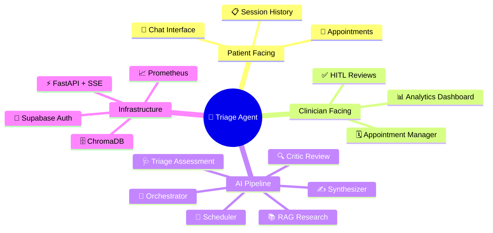

### Key Capabilities

| | Feature | Description |
|---|---------|-------------|
| 🤖 | **Multi-Agent Pipeline** | 6 agents orchestrated via LangGraph StateGraph with MemorySaver checkpointing |
| 🔀 | **Dual LLM Providers** | Switch Anthropic Claude ↔ llama.cpp (local, zero-cost) with one env var |
| 📚 | **RAG Knowledge Base** | ChromaDB + 18 WHO/NICE/AHA guidelines + PDF ingestion, fully offline |
| ⚡ | **Real-time Streaming** | SSE token-by-token output with agent step events |
| 👩‍⚕️ | **HITL Safety Net** | Auto-escalate to clinician when confidence score < threshold |
| 🔐 | **Supabase Auth** | Email/password with role-based routing (patient vs. clinician) |
| 📊 | **Full Observability** | Prometheus metrics + structlog with PII auto-redaction |
| 🐳 | **Container Ready** | Multi-stage Docker builds + Docker Compose full stack |

---

## 🏗️ Architecture

### System Architecture

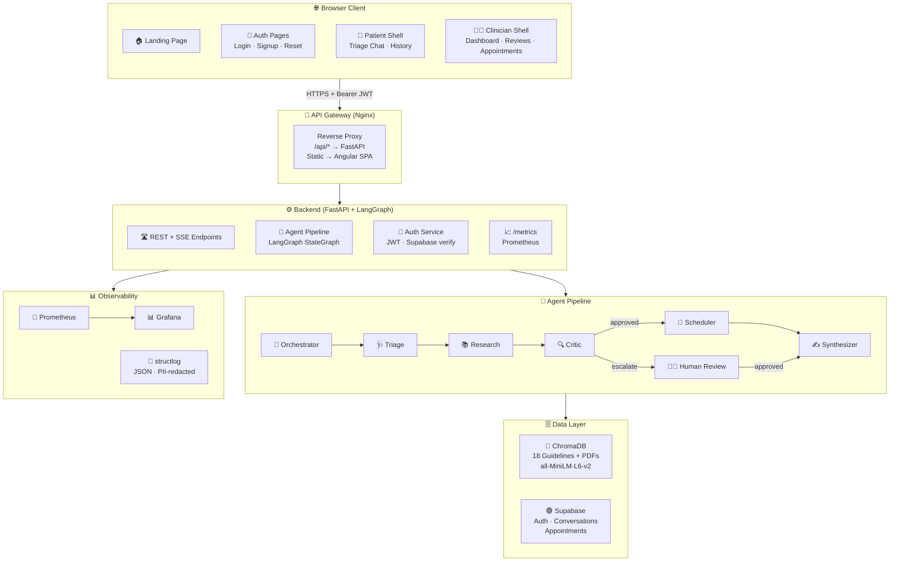

---

### Agent Pipeline

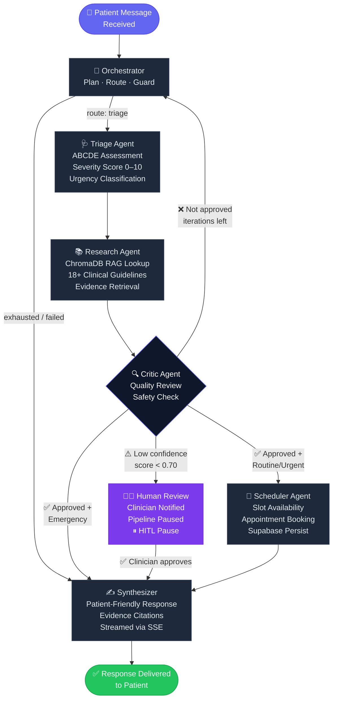

---

### Data Flow

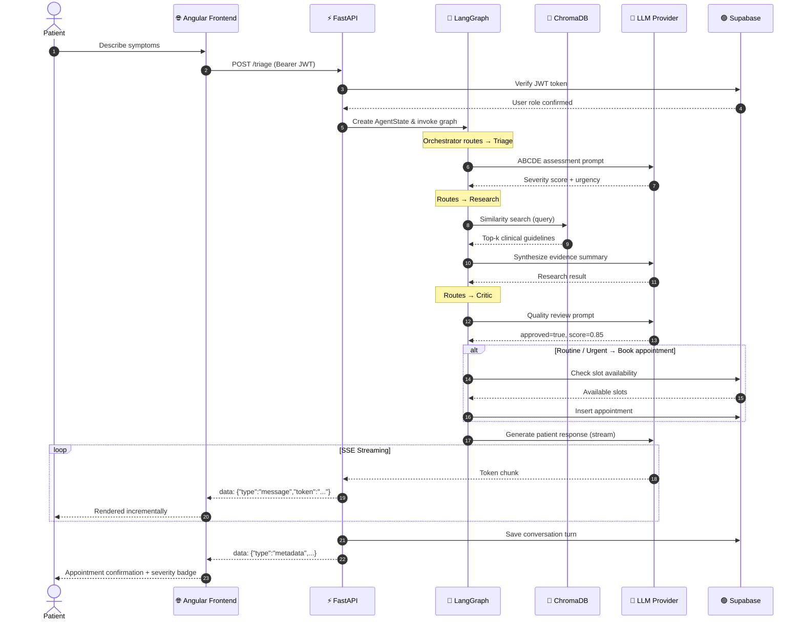

---

### Frontend Structure

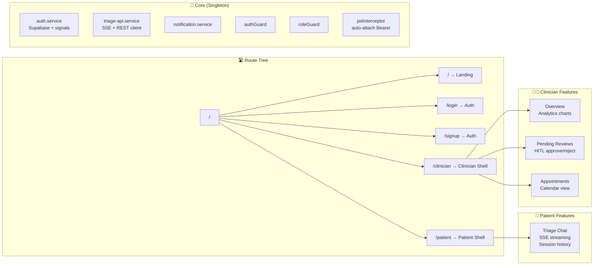

---

## 🛠️ Tech Stack

### Backend

| Layer | Technology | Purpose |
|-------|-----------|---------|
| 🌐 **API** | FastAPI 0.111+ | Async REST + SSE endpoints |
| 🔄 **Orchestration** | LangGraph StateGraph | Multi-agent pipeline & routing |
| 🤖 **LLM (Cloud)** | Anthropic Claude | Production-grade reasoning |
| 🤖 **LLM (Local)** | llama.cpp OpenAI-compat | Zero-cost offline inference |
| 🔵 **Vector Store** | ChromaDB + sentence-transformers | RAG over clinical guidelines |
| 🟢 **Database** | Supabase (PostgreSQL) | Conversations + appointments |
| 🔑 **Auth** | Supabase Auth + JWT HS256 | User sessions + API auth |
| ✅ **Validation** | Pydantic v2 | Strict typed state models |
| 🚦 **Rate Limiting** | SlowAPI | Per-IP request throttling |
| 📝 **Logging** | structlog | JSON + PII redaction |
| 📈 **Metrics** | prometheus-client | Counters, histograms, gauges |
| 🔁 **Resilience** | tenacity | Retry with backoff |

### Frontend

| Layer | Technology | Purpose |
|-------|-----------|---------|
| 🅰️ **Framework** | Angular 21 | Standalone components + signals |
| 🎨 **UI** | Angular Material 21 | Component library + theming |
| 🔐 **Auth** | Supabase JS SDK | Session persistence + OAuth ready |
| 📊 **Charts** | Chart.js + ng2-charts | Clinician analytics |
| ⚡ **Streaming** | Fetch API + ReadableStream | SSE event parsing |
| 🎭 **Styling** | SCSS + custom design system | Theming + animations |
| 🧪 **Testing** | Vitest + jsdom | Unit tests |
| 🐳 **Serving** | Nginx 1.27 Alpine | SPA routing + API proxy |

### Infrastructure

| Component | Technology |
|-----------|-----------|
| 🐳 **Containers** | Docker multi-stage builds |
| 🔀 **Proxy** | Nginx (SPA + API reverse proxy) |
| 📊 **Monitoring** | Prometheus + Grafana |
| 🔄 **CI/CD** | GitHub Actions (2 workflows) |
| ☁️ **Deploy** | Azure Web App (BE) · Docker Compose |

---

## 📁 Repository Structure

```
healthcare-triage-agent/
│
├── 📂 .github/workflows/
│   ├── ci.yml                    # Backend: lint → test → coverage → Docker
│   └── frontend-ci.yml           # Frontend: test → build → Docker image
│
├── 📂 src/                       # Python backend
│   ├── 📂 api/
│   │   ├── main.py               # FastAPI app, SSE streaming, rate limiting
│   │   ├── auth.py               # JWT + Supabase token verification
│   │   ├── schemas.py            # Pydantic request/response models
│   │   └── conversation_store.py # Supabase conversation persistence
│   ├── 📂 agents/
│   │   ├── orchestrator.py       # Plans, routes, guards max iterations
│   │   ├── triage_agent.py       # ABCDE assessment + severity scoring
│   │   ├── research_agent.py     # ChromaDB RAG retrieval
│   │   ├── scheduler_critic_agents.py  # Booking + quality review
│   │   └── synthesizer.py        # Response generation + HITL node
│   ├── 📂 graph/
│   │   └── pipeline.py           # LangGraph StateGraph wiring
│   ├── 📂 llm/
│   │   └── provider.py           # LLM factory (Anthropic / llama.cpp)
│   ├── 📂 memory/
│   │   └── retriever.py          # ChromaDB LangChain wrapper
│   ├── 📂 tools/
│   │   └── clinical_tools.py     # Symptom lookup, severity scale, booking
│   ├── 📂 observability/
│   │   ├── logging.py            # structlog + PII redaction
│   │   └── metrics.py            # Prometheus counters/histograms/gauges
│   ├── agent_state.py            # Pydantic v2 shared AgentState model
│   ├── config.py                 # Pydantic settings (from .env)
│   └── db.py                     # Supabase appointment database
│
├── 📂 frontend/                  # Angular 21 SPA
│   ├── 📂 src/app/
│   │   ├── core/                 # Guards, interceptors, services, models
│   │   ├── features/             # auth/ patient/ clinician/ landing/
│   │   └── shared/               # Components, pipes, directives, animations
│   ├── Dockerfile                # Multi-stage: Node 20 → Nginx 1.27
│   └── nginx.conf                # SPA routing + /api proxy
│
├── 📂 monitoring/
│   └── prometheus.yml            # 15s scrape config
│
├── 📂 scripts/
│   ├── seed_knowledge.py         # Seed ChromaDB (18 guidelines + PDFs)
│   ├── check_env.py              # Pre-flight environment checker
│   ├── download_model.py         # GGUF model downloader
│   └── migrate_to_supabase.py   # Migration helper
│
├── 📂 tests/
│   ├── test_all.py               # 500+ line test suite (unit + integration)
│   └── test_provider.py          # LLM provider tests
│
├── 📂 examples/
│   └── scenarios.py              # 3 demo scenarios (emergency/routine/HITL)
│
├── 📂 data/                      # Runtime data (gitignored)
│   ├── chroma/                   # ChromaDB persistent storage
│   ├── sessions/                 # LangGraph session files
│   └── failed_flows/             # Failed pipeline state dumps
│
├── Makefile                      # 20+ automation targets
├── pyproject.toml                # Python deps + tool config
├── .env.example                  # All env vars documented
└── .gitignore
```

---

## 🚀 Setup Instructions

### Prerequisites

| Requirement | Version | Notes |
|-------------|---------|-------|
| 🐍 Python | `3.11+` | Use pyenv or official installer |
| 📦 Node.js | `20+` | LTS recommended |
| 📦 npm | `11+` | Included with Node |
| 🐙 Git | `2.40+` | |
| 🛠️ Make | `4.0+` | Required for automation targets |
| 🐳 Docker | `24+` | Optional — for containerised stack |

> 💡 **Windows Users**: You will need `make` installed. The easiest way is via [Chocolatey](https://chocolatey.org/): `choco install make`. Alternatively, use WSL (Windows Subsystem for Linux) or Git Bash. Mac/Linux users typically have `make` pre-installed (`brew install make` or `apt install make` if missing).

---

### Backend (Local Development)

```bash
# 1. Clone
git clone https://github.com/Sreethesh007/HackathonAiAgent.git
cd HackathonAiAgent

# 2. Virtual environment
python -m venv venv
source venv/bin/activate        # macOS/Linux
venv\Scripts\activate           # Windows

# 3. Install (with dev extras)
pip install -e ".[dev]"

# 4. Configure environment
cp .env.example .env
# ✏️  Edit .env — minimum required:
#     ANTHROPIC_API_KEY, JWT_SECRET, SUPABASE_URL, SUPABASE_KEY

# 5. Pre-flight check
python scripts/check_env.py

# 6. Seed knowledge base (first run only)
python scripts/seed_knowledge.py

# 7. Start API (hot-reload)
make run-dev
# or: uvicorn src.api.main:app --host 0.0.0.0 --port 8000 --reload
```

| Endpoint | URL |
|----------|-----|
| 🌐 API | http://localhost:8000 |
| 📄 Swagger UI | http://localhost:8000/docs |
| 📄 ReDoc | http://localhost:8000/redoc |
| 📈 Metrics | http://localhost:8000/metrics |

---

### Frontend (Local Development)

```bash
cd frontend

# 1. Configure environment
cp .env.example .env
# ✏️  Edit .env — set SUPABASE_URL and SUPABASE_KEY

# 2. Install dependencies
npm install

# 3. Start dev server (proxies /api/* → localhost:8000)
npm start
```

> 💡 `npm start` runs `npm run config && ng serve`. The config script reads `frontend/.env` and generates `environment.ts`.

Frontend available at **http://localhost:4200**

---

### Full Stack with Docker Compose

```bash
docker compose up --build -d
```

| Service | URL | Credentials |
|---------|-----|-------------|
| ⚡ FastAPI | http://localhost:8000 | Bearer JWT |
| 🔵 ChromaDB | http://localhost:8001 | — |
| 🔴 Prometheus | http://localhost:9090 | — |
| 📊 Grafana | http://localhost:3000 | `admin` / `admin` |

```bash
docker compose logs -f app   # Follow API logs
docker compose down          # Tear down
```

---

### Local Models with llama.cpp

Run fully offline — no API keys required:

```bash
# 1. Build llama.cpp
git clone https://github.com/ggerganov/llama.cpp
cd llama.cpp && cmake -B build && cmake --build build -j$(nproc)

# 2. Download a model
python scripts/download_model.py --model llama3.1-8b-q4

# 3. Start llama.cpp server
./build/bin/llama-server \
  -m models/llama-3.1-8b-instruct.Q4_K_M.gguf \
  --host 0.0.0.0 --port 8080 \
  --n-gpu-layers 0 --threads 4 --ctx-size 4096

# 4. Switch provider
# In .env: LLM_PROVIDER=llamacpp

# 5. Verify + start
make check-llamacpp && make run-dev
```

**Recommended models by available RAM:**

| Model | RAM | Quality |
|-------|-----|---------|
| `phi-3-mini-4k-instruct.Q4_K_M.gguf` | 3 GB | ⭐⭐ |
| `llama-3.1-8b-instruct.Q4_K_M.gguf` | 6 GB | ⭐⭐⭐ |
| `llama-3.1-8b-instruct.Q8_0.gguf` | 8 GB | ⭐⭐⭐⭐ |
| `mistral-7b-instruct-v0.3.Q4_K_M.gguf` | 5 GB | ⭐⭐⭐ |

---

## ⚙️ Environment Variables

All variables are documented in [`.env.example`](.env.example). Copy it to `.env` to get started.

<details>
<summary><b>🤖 LLM Provider</b></summary>

| Variable | Description | Default |
|----------|-------------|---------|
| `LLM_PROVIDER` | `anthropic` or `llamacpp` | `anthropic` |
| `ANTHROPIC_API_KEY` | Anthropic API key | — |
| `LLM_MODEL` | Anthropic model name | `claude-sonnet-4-20250514` |
| `LLAMACPP_BASE_URL` | llama.cpp server URL | `http://localhost:8080` |
| `LLAMACPP_MODEL` | Local model display name | `llama-3.1-8b-instruct` |
| `LLAMACPP_N_CTX` | Context window | `4096` |
| `LLM_MAX_TOKENS` | Max output tokens | `2048` |
| `LLM_TEMPERATURE` | Sampling temperature | `0.1` |

</details>

<details>
<summary><b>🔵 Vector Store & Memory</b></summary>

| Variable | Description | Default |
|----------|-------------|---------|
| `CHROMA_PERSIST_DIR` | ChromaDB storage path | `./data/chroma` |
| `CHROMA_COLLECTION_NAME` | Collection name | `medical_guidelines` |
| `SESSION_DIR` | Session state path | `./data/sessions` |
| `SESSION_TTL_SECONDS` | Session time-to-live | `7200` |
| `MEMORY_WINDOW_SIZE` | Conversation window size | `10` |

</details>

<details>
<summary><b>🔄 Agent Pipeline</b></summary>

| Variable | Description | Default |
|----------|-------------|---------|
| `MAX_AGENT_ITERATIONS` | Max pipeline loop iterations | `10` |
| `MAX_FLOW_DURATION_SECONDS` | Pipeline hard timeout | `120` |
| `AGENT_RETRY_ATTEMPTS` | LLM retries per agent | `3` |
| `HUMAN_APPROVAL_THRESHOLD` | Critic score → HITL trigger | `0.70` |

</details>

<details>
<summary><b>🔑 API & Auth</b></summary>

| Variable | Description | Default |
|----------|-------------|---------|
| `API_HOST` | Bind address | `0.0.0.0` |
| `API_PORT` | Port | `8000` |
| `CORS_ORIGINS` | Allowed origins (comma-sep) | `http://localhost:3000` |
| `RATE_LIMIT_PER_MINUTE` | Requests/min per IP | `10` |
| `JWT_SECRET` | JWT signing secret ⚠️ **change in prod** | `change_me` |
| `JWT_ALGORITHM` | JWT algorithm | `HS256` |
| `JWT_EXPIRE_MINUTES` | Token TTL | `60` |
| `SUPABASE_URL` | Supabase project URL | — |
| `SUPABASE_KEY` | Supabase anon key | — |

</details>

<details>
<summary><b>📊 Observability</b></summary>

| Variable | Description | Default |
|----------|-------------|---------|
| `LOG_LEVEL` | Logging verbosity | `INFO` |
| `ENVIRONMENT` | `development` or `production` | `development` |
| `LANGCHAIN_TRACING_V2` | LangSmith tracing | `false` |
| `OTEL_EXPORTER_OTLP_ENDPOINT` | OpenTelemetry endpoint | — |

</details>

---

## 📖 Usage

### Seeding the Knowledge Base

The system needs a seeded ChromaDB collection to perform evidence-based triage. The seeder ships with **18 built-in clinical guidelines** (WHO, NICE, AHA) across emergency, urgent, and routine categories.

```bash
python scripts/seed_knowledge.py         # Seed (skip existing)
python scripts/seed_knowledge.py --reset # Wipe and reseed

make seed-knowledge                      # Makefile shortcut
```

> 📄 **Add custom guidelines**: Drop PDF files into `data/knowledge/` and re-run the seeder. It automatically chunks (800 chars, 150 char overlap) and embeds them using `all-MiniLM-L6-v2`.

---

### API Endpoints

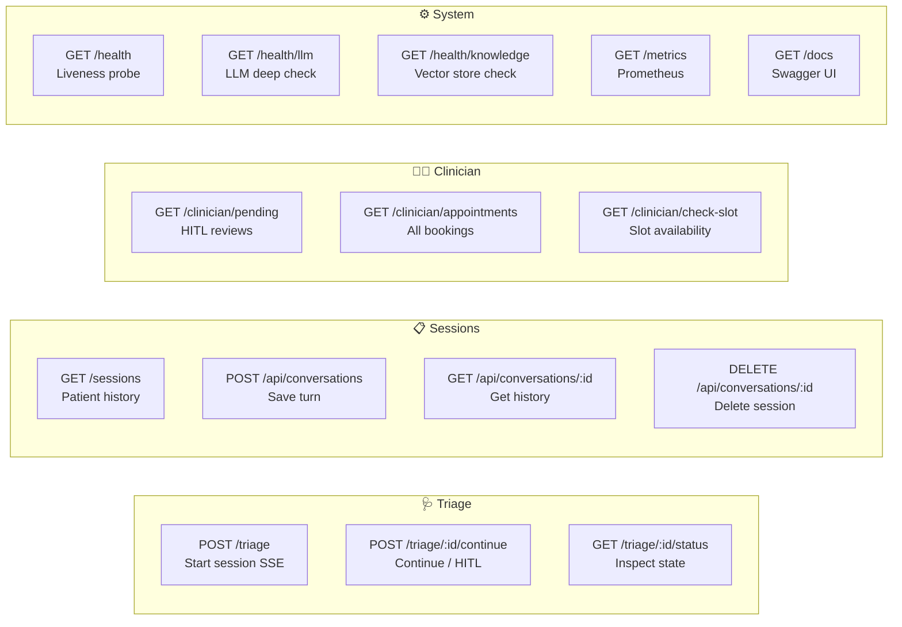

**SSE Event Types** (from `/triage` and `/triage/:id/continue`):

| Event | Description |
|-------|-------------|
| `step_start` | Agent node started (`triage`, `research`, …) |
| `thinking` | LLM tokens from intermediate agents |
| `message` | Final synthesizer tokens (patient response) |
| `step_content` | Per-agent reasoning summary |
| `metadata` | Final session data (severity, urgency, appointment) |
| `error` | Error details |

---

### Example API Calls

#### Start a Triage Session

```bash
# Obtain a token
TOKEN=$(python -c "from src.api.auth import create_access_token; print(create_access_token('patient-001'))")

# Start triage — SSE stream
curl -N \
  -H "Authorization: Bearer $TOKEN" \
  -H "Content-Type: application/json" \
  -d '{"message": "I have severe chest pain radiating to my left arm. I am sweating and feel nauseous."}' \
  http://localhost:8000/triage

# Example SSE response stream:
# data: {"type":"step_start","agent":"triage","message":"Starting triage assessment"}
# data: {"type":"thinking","token":"Assessing"}
# data: {"type":"message","token":"Based on your symptoms..."}
# data: {"type":"metadata","severity_score":9,"urgency_level":"emergency","appointment_booked":false}
```

#### Continue / Approve HITL

```bash
# Follow-up message
curl -N -H "Authorization: Bearer $TOKEN" \
  -H "Content-Type: application/json" \
  -d '{"message": "The pain started 20 minutes ago", "patient_id": "patient-001"}' \
  http://localhost:8000/triage/{session_id}/continue

# Clinician approves HITL
curl -N -H "Authorization: Bearer $TOKEN" \
  -H "Content-Type: application/json" \
  -d '{"human_approval": true}' \
  http://localhost:8000/triage/{session_id}/continue
```

#### Health Check

```bash
curl http://localhost:8000/health
# → {"status":"ok","version":"1.0.0","llm_provider":"anthropic","pipeline_ready":true}

curl http://localhost:8000/health/knowledge
# → {"status":"ok","document_count":18,"collection":"medical_guidelines"}
```

---

### Demo Scenarios

```bash
make run-scenarios   # or: python examples/scenarios.py
```

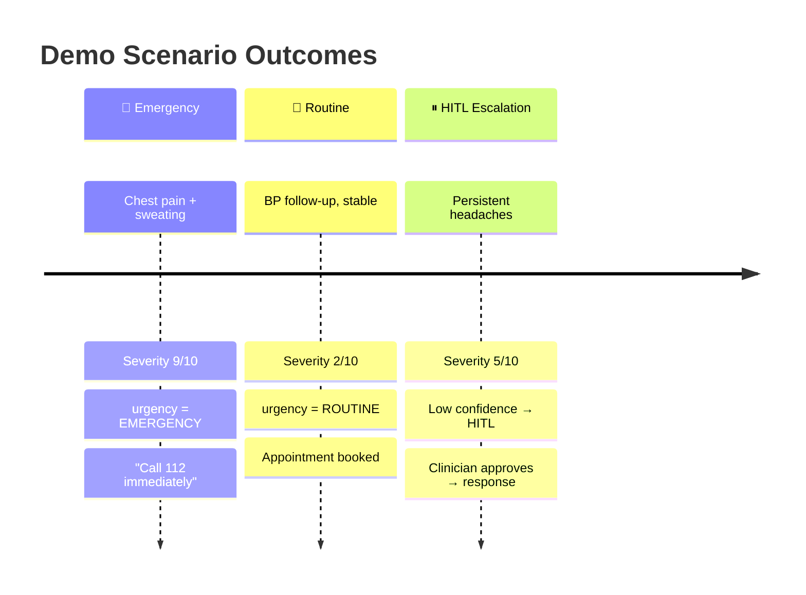

**Clinician demo login** (frontend only): `clinician@gmail.com` / `clinician`

---

## 🧪 Testing

### Coverage Targets

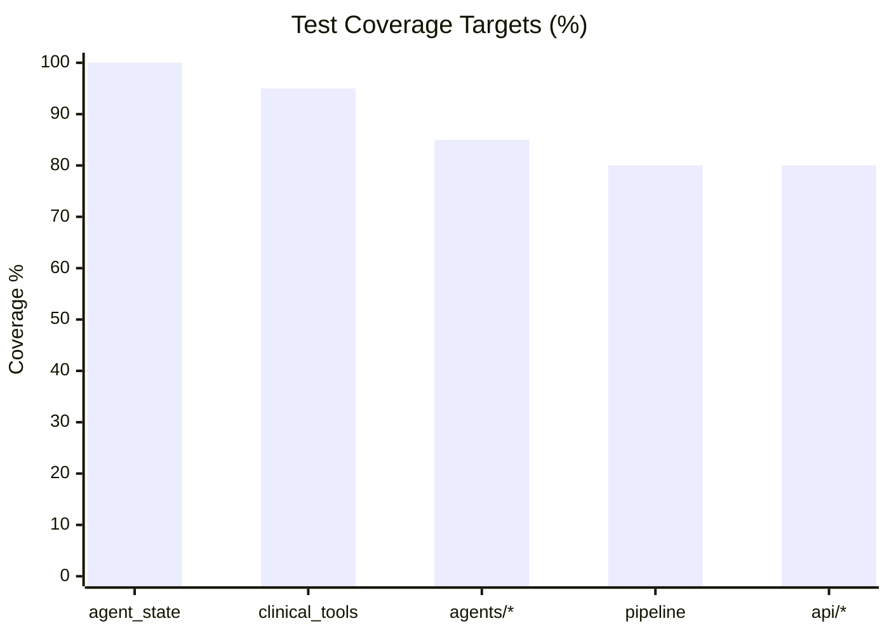

### Test Suite Overview

The `tests/test_all.py` suite (500+ lines) covers:

| Stage | Class | What's tested |
|-------|-------|---------------|
| 1 | `TestAgentState` | Instantiation, PII redaction, serialization, iteration guards |
| 2 | `TestClinicalTools` | Symptom lookup, severity scale, appointment booking |
| 3 | `TestTriageAgent` | Assessment, emergency override, LLM failure fallback |
| 4 | `TestResearchAgent` | Vector store retrieval, built-in fallback |
| 5 | `TestOrchestratorAgent` | Routing, max iterations, failure detection |
| 6 | `TestCriticAgent` | Approval, misclassification, failure → HITL |
| 7 | `TestPipelineIntegration` | End-to-end with mocked LLMs, loop termination |
| 8 | `TestAuth` | JWT creation, decoding, expiration |

```bash
make test           # Full suite + coverage report
make test-fast      # No coverage (faster)
make test-watch     # Re-run on file changes
make lint           # ruff check
make format         # black + ruff fix
make typecheck      # mypy
```

---

## 🔄 CI/CD

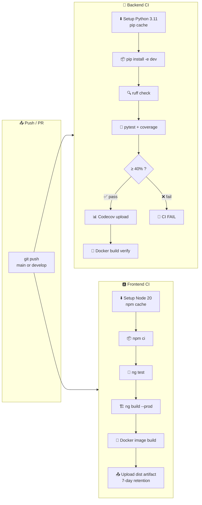

---

## ☁️ Deployment

### Deployment Topology

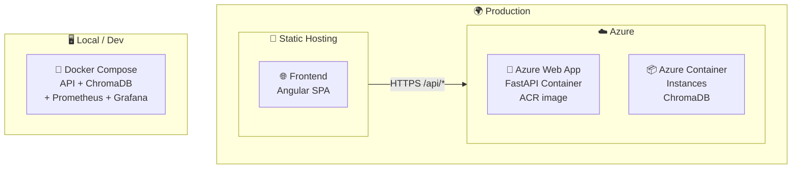

### Docker Multi-Stage Build

```dockerfile
# Frontend: Node 20 → Nginx 1.27
FROM node:20-alpine AS builder    # Build Angular AOT bundle
FROM nginx:1.27-alpine AS runtime # Serve + proxy /api/*
```

### Deploy Commands

```bash
# Production Angular build
cd frontend && npx ng build --configuration production

# Full stack (local)
docker compose up --build -d

# Backend → Azure Web App
# 1. Push image to ACR
# 2. Point Web App to ACR image
# 3. Set all .env vars in App Service config
# 4. Set ENVIRONMENT=production (enables JSON logs + PII redaction)
```

---

## 📊 Observability

### Metrics Overview

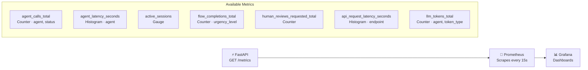

### Key PromQL Queries

```promql
# ── Request Rate ──────────────────────────────────────────────────
rate(api_requests_total[5m])

# ── p95 API Latency ───────────────────────────────────────────────
histogram_quantile(0.95, rate(api_request_latency_seconds_bucket[5m]))

# ── Agent Error Rate ──────────────────────────────────────────────
rate(agent_calls_total{status="error"}[5m])
  / rate(agent_calls_total[5m])

# ── Triage Completions by Urgency ─────────────────────────────────
sum by (urgency_level) (flow_completions_total)

# ── HITL Escalation Rate ──────────────────────────────────────────
rate(human_reviews_requested_total[1h])

# ── LLM Token Cost by Agent ───────────────────────────────────────
sum by (agent) (rate(llm_tokens_total[1h]))
```

### Structured Logging

| Environment | Format | PII |
|-------------|--------|-----|
| `development` | Colourised console | Plain text |
| `production` | JSON (one line per event) | SHA-256 hashed |

Fields auto-redacted in production: `patient_id`, `current_input`, `message_content`, `patient_name`

---

## 🔒 Security

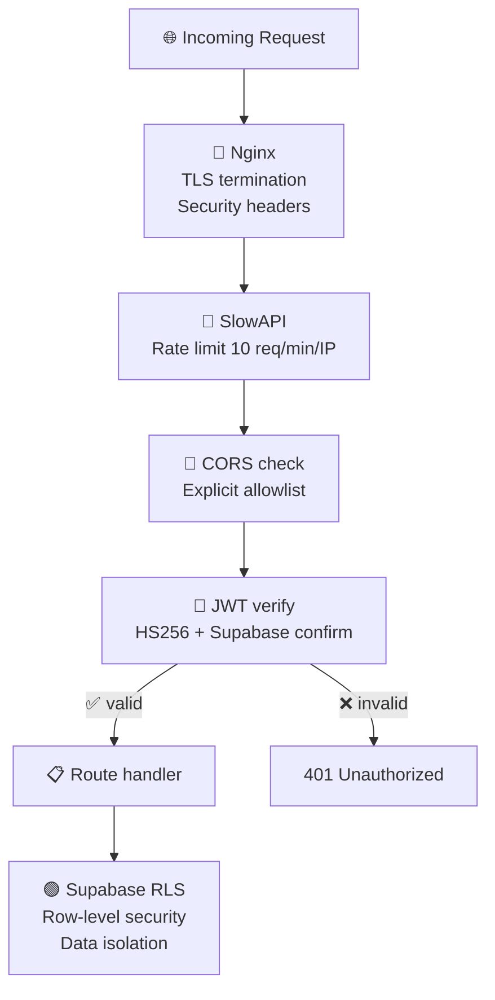

**Checklist for production deployments:**

- [ ] 🔑 Rotate `JWT_SECRET` — use `python -c "import secrets; print(secrets.token_urlsafe(48))"`
- [ ] 🟢 Enable Supabase RLS on `conversations` and `appointments` tables
- [ ] 🌐 Set `CORS_ORIGINS` to your exact frontend domain — never use `*`
- [ ] 🔒 Terminate TLS at load balancer or Nginx — never expose API over plain HTTP
- [ ] 📝 Set `ENVIRONMENT=production` to enable JSON logging + PII redaction
- [ ] 🚫 Remove mock clinician bypass (`clinician@gmail.com`) in production auth code
- [ ] 📁 Keep GGUF models outside web-accessible directories
- [ ] 🙈 Verify `.env` is in `.gitignore` — never commit secrets

---

## 🔧 Troubleshooting

<details>
<summary><b>🔴 Environment / Startup Issues</b></summary>

| Symptom | Fix |
|---------|-----|
| `.env` file not found | `cp .env.example .env` and fill values |
| `ANTHROPIC_API_KEY` missing | Get one at [console.anthropic.com](https://console.anthropic.com) |
| `Invalid LLM configuration` | `python scripts/check_env.py` |
| `JWT_SECRET` is placeholder | Generate: `python -c "import secrets; print(secrets.token_urlsafe(32))"` |
| `503 Pipeline not ready` | Wait for startup logs — ChromaDB initialises async |

</details>

<details>
<summary><b>🔵 ChromaDB / Knowledge Base</b></summary>

| Symptom | Fix |
|---------|-----|
| `knowledge_base_empty` warning | `python scripts/seed_knowledge.py --reset` |
| `PersistentClient` errors | Ensure `./data/chroma/` exists and is writable |
| `sentence-transformers` not found | `pip install sentence-transformers` |
| Embedding dimension mismatch | `seed_knowledge.py --reset` (recreates collection) |

</details>

<details>
<summary><b>🤖 llama.cpp Issues</b></summary>

| Symptom | Fix |
|---------|-----|
| Server not reachable | `make check-llamacpp` — ensure server is started first |
| Slow inference | Lower `LLAMACPP_N_CTX`, raise `LLAMACPP_N_THREADS` |
| Out of memory | Use a smaller quant: `phi-3-mini-4k-instruct.Q4_K_M.gguf` (3 GB) |
| Model file not found | `python scripts/download_model.py --list` |

</details>

<details>
<summary><b>🐳 Docker Issues</b></summary>

| Symptom | Fix |
|---------|-----|
| Port 8000 in use | Change `API_PORT` in `.env` and update compose |
| Port 3000 conflict (Grafana) | Edit port mapping in `docker-compose.yml` |
| ARM build fails | `docker buildx create --use` |
| ChromaDB permission error | `chmod -R 777 ./data/chroma` |

</details>

<details>
<summary><b>🌐 Frontend / Auth Issues</b></summary>

| Symptom | Fix |
|---------|-----|
| `/api/*` returns 502 | Ensure backend on port 8000; check `proxy.conf.json` |
| Supabase auth errors | Verify `SUPABASE_URL` + `SUPABASE_KEY` in `frontend/.env` |
| CORS errors | Add frontend URL to `CORS_ORIGINS` in backend `.env` |
| SSE stream cuts off | Raise `proxy_read_timeout` in `nginx.conf`; check firewalls |
| `environment.ts` has wrong values | `npm run config` (reads `frontend/.env`) |
| `401` on all API calls | Re-login — token expired; check `JWT_EXPIRE_MINUTES` |

</details>

---

## 🤝 Contributing

Contributions are welcome!

```bash
# 1. Fork + branch from develop
git checkout -b feature/my-improvement

# 2. Install everything
pip install -e ".[dev]" && cd frontend && npm install

# 3. Develop + test
make test && cd frontend && npm test

# 4. Lint + format
make lint && make format

# 5. Open PR against main
```

### Makefile Reference

```bash
make help              # List all targets
make install           # Install all dependencies
make run-dev           # Start API with hot-reload
make test              # Tests + coverage
make test-fast         # Tests (no coverage)
make lint              # ruff linter
make format            # black + ruff fix
make typecheck         # mypy
make seed-knowledge    # Seed vector store
make token USER=alice  # Generate dev JWT
make run-scenarios     # Run demo scenarios
make export-graph      # Export pipeline diagram → docs/graph.md
make clean             # Remove caches + generated files
```

---

<div align="center">


[](https://fastapi.tiangolo.com/)
[](https://langchain-ai.github.io/langgraph/)
[](https://angular.dev/)
[](https://www.trychroma.com/)
[](https://supabase.com/)


</div>
