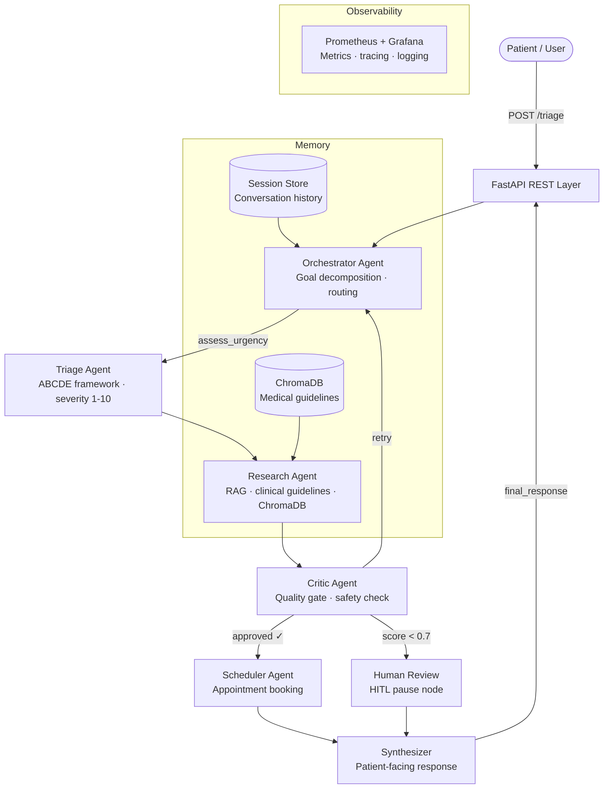

# 🏥 Healthcare Triage Agent

An **autonomous multi-agent AI system** for healthcare triage and patient management. Built with LangGraph, Claude (Anthropic), FastAPI, and ChromaDB — deployable entirely on-premise with no external data dependencies beyond the LLM API.

> **Disclaimer:** This system is a demonstration of agentic AI architecture. It is **not** a medical device and must not replace professional clinical judgement. Always direct patients to qualified healthcare providers for actual medical decisions.

---

## Architecture



### Agent Roles

| Agent | Role | Tools | Key Output |
|---|---|---|---|
| **Orchestrator** | Goal decomposition, task routing | — | `next_agent`, `reasoning_trace` |
| **Triage** | ABCDE symptom assessment | `symptom_lookup`, `severity_scale` | `severity_score` (1-10), `urgency_level` |
| **Research** | Retrieve clinical guidelines | `vector_search` (ChromaDB) | `summary`, `guidelines_applied`, `confidence_score` |
| **Scheduler** | Book appointments | `check_availability`, `book_appointment` | `appointment_id`, `datetime`, `provider` |
| **Critic** | Quality & safety gate | — | `quality_score`, `approved`, `requires_human_review` |
| **Synthesizer** | Final patient response | — | `final_response` |

---

## Quick Start

### Prerequisites
- Python 3.11+
- Node.js 18+ and npm (for frontend)
- Build tools: `make` (for setup automation) and `cmake` / `C++ compiler` (if building llama.cpp locally)
- Docker & Docker Compose (for full stack)
- Anthropic API key ([get one here](https://console.anthropic.com))

### Option A — Local Development (Backend & Frontend)

```bash
# 1. Clone and enter the project
git clone https://github.com/your-org/healthcare-triage-agent
cd healthcare-triage-agent

# 2. Install backend dependencies
make install
# Or manually:
# python -m venv .venv
# source .venv/bin/activate  # (On Windows: .venv\Scripts\activate)
# pip install -e ".[dev]"

# 3. Configure backend environment
cp .env.example .env
nano .env   # Set ANTHROPIC_API_KEY and JWT_SECRET

# 4. Verify setup
make env-check
# Or manually: python scripts/check_env.py

# 5. Seed the medical knowledge base
python scripts/seed_knowledge.py

# 6. Generate a dev JWT token
make token USER=dev-user
# Or manually: python -c "from src.api.auth import create_access_token; print(create_access_token('dev-user'))"
# → eyJhbGciOiJIUzI1NiJ9...

# 7. Start the API (Backend)
make run-dev
# Or manually: uvicorn src.api.main:app --host 0.0.0.0 --port 8000 --reload
# API → http://localhost:8000
# Docs → http://localhost:8000/docs

# 8. Start the Frontend (In a new terminal)
cd frontend
npm install
cp .env.example .env
npm start
# Frontend → http://localhost:4200
```

### Option B — Docker Compose (recommended for on-premise)

```bash
# 1. Configure environment
cp .env.example .env
nano .env   # Set ANTHROPIC_API_KEY and JWT_SECRET

# 2. Start the full stack (API + ChromaDB + Prometheus + Grafana)
make run-docker

# Services:
#   API          → http://localhost:8000
#   API Docs     → http://localhost:8000/docs
#   ChromaDB     → http://localhost:8001
#   Prometheus   → http://localhost:9090
#   Grafana      → http://localhost:3000  (admin / admin)

# 3. Seed knowledge base inside the container
docker compose exec app python scripts/seed_knowledge.py

# 4. Generate a JWT token
docker compose exec app python -c "
from src.api.auth import create_access_token
print(create_access_token('admin', role='clinician'))
"
```

### Option C — Local Models with llama.cpp (Zero API Cost)

You can run the entire system 100% locally without external APIs. This requires about 6-8GB of RAM.

```bash
# 1. Install python dependencies for llama.cpp and download a model
make install-llamacpp
make download-model MODEL=llama3.1-8b-q4

# 2. Start the llama.cpp server in a separate terminal
# (Requires llama.cpp to be downloaded and built: https://github.com/ggerganov/llama.cpp)
./path/to/llama.cpp/build/bin/llama-server \
  -m models/llama-3.1-8b-instruct.Q4_K_M.gguf \
  --port 8080 --ctx-size 4096

# 3. Configure the environment to use the local model
make use-llamacpp
# (This sets LLM_PROVIDER=llamacpp in your .env file)

# 4. Verify the server is reachable
make check-llamacpp

# 5. Start the backend and frontend as described in Option A
```

---

## API Reference

All endpoints require `Authorization: Bearer <JWT>` header.

### Start a triage session

```bash
POST /triage
Content-Type: application/json

{
  "patient_id": "P12345",
  "message": "I have severe chest pain radiating to my left arm"
}
```

**Response:**
```json
{
  "session_id": "550e8400-e29b-41d4-a716-446655440000",
  "response": "⚠️ Based on your symptoms, please call 112 immediately...",
  "severity_score": 9,
  "urgency_level": "emergency",
  "primary_concern": "chest pain",
  "sources": ["AHA Guidelines", "WHO Emergency Protocol"],
  "guidelines_applied": ["AHA Guidelines"],
  "appointment_booked": false,
  "appointment_id": null,
  "requires_human_review": false,
  "quality_score": 0.92,
  "iteration_count": 3
}
```

### Continue a session (multi-turn or HITL)

```bash
# Follow-up message
POST /triage/{session_id}/continue
{"message": "The pain has gotten worse", "patient_id": "P12345"}

# Human reviewer approval (for HITL-paused sessions)
POST /triage/{session_id}/continue
{"human_approval": true}
```

### Check session status

```bash
GET /triage/{session_id}/status
```

### Health check

```bash
GET /health
# → {"status": "ok", "version": "1.0.0", "uptime_seconds": 120}
```

### Metrics (Prometheus)

```bash
GET /metrics
```

---

## Demo Scenarios

With a real `ANTHROPIC_API_KEY` set, run all three end-to-end scenarios:

```bash
python examples/scenarios.py
```

**Scenario 1 — Emergency Cardiac Event**
> "I have severe chest pain radiating to my left arm and jaw..."
→ Emergency (score 9) → No appointment booked → "call 112 immediately"

**Scenario 2 — Routine Follow-up**
> "I need to schedule a blood pressure check, everything seems stable..."
→ Routine (score 2) → Appointment booked → Confirmation with datetime

**Scenario 3 — Ambiguous Symptoms (HITL)**
> "I've been having headaches for 3 days with nausea..."
→ Urgent (score 5) → Critic score < 0.7 → Human review pause → Reviewer approves → Response

---

## Adding a New Agent

1. Create `src/agents/my_agent.py` with a class following this pattern:

```python
class MyAgent:
    def __init__(self, llm=None):
        self.llm = llm or ChatAnthropic(model=settings.llm_model, ...)
        self.name = AgentName.MY_AGENT   # add to enum in agent_state.py

    def run(self, state: AgentState) -> AgentState:
        # Read from state, call LLM/tools, write back to state
        state.add_trace("MY_AGENT: did something")
        return state
```

2. Add `MY_AGENT = "my_agent"` to `AgentName` enum in `src/agent_state.py`

3. Register the node in `src/graph/pipeline.py`:
```python
g.add_node("my_agent", self._node_my_agent)
g.add_edge("research", "my_agent")
g.add_edge("my_agent", "critic")
```

4. Add tests in `tests/test_all.py` for the new agent

5. Run `make test` to verify

---

## Configuration Reference

| Variable | Required | Default | Description |
|---|---|---|---|
| `ANTHROPIC_API_KEY` | ✅ | — | Anthropic API key |
| `JWT_SECRET` | ✅ | — | Long random string for JWT signing |
| `LLM_MODEL` | | `claude-sonnet-4-20250514` | Claude model to use |
| `CHROMA_PERSIST_DIR` | | `./data/chroma` | ChromaDB storage path |
| `MAX_AGENT_ITERATIONS` | | `10` | Max pipeline loops before termination |
| `HUMAN_APPROVAL_THRESHOLD` | | `0.70` | Critic score below this → human review |
| `ENVIRONMENT` | | `development` | `development` or `production` |
| `LOG_LEVEL` | | `INFO` | `DEBUG`, `INFO`, `WARNING`, `ERROR` |
| `API_PORT` | | `8000` | API server port |
| `RATE_LIMIT_PER_MINUTE` | | `10` | Requests per minute per IP |
| `SESSION_TTL_SECONDS` | | `7200` | Session expiry (2 hours) |

---

## Project Structure

```
healthcare-triage-agent/
├── src/
│   ├── agent_state.py           # Shared state schema (Pydantic v2)
│   ├── config.py                # Settings (pydantic-settings)
│   ├── agents/
│   │   ├── orchestrator.py      # Goal decomposition + routing
│   │   ├── triage_agent.py      # ABCDE symptom assessment
│   │   ├── research_agent.py    # RAG-based guideline retrieval
│   │   ├── scheduler_critic_agents.py  # Booking + quality gate
│   │   └── synthesizer.py       # Final response + HITL node
│   ├── graph/
│   │   └── pipeline.py          # LangGraph StateGraph pipeline
│   ├── api/
│   │   ├── main.py              # FastAPI app + endpoints
│   │   ├── schemas.py           # Request/response models
│   │   └── auth.py              # JWT authentication
│   ├── tools/
│   │   └── clinical_tools.py    # Symptom lookup, scheduling tools
│   └── observability/
│       ├── logging.py           # structlog + PII redaction
│       └── metrics.py           # Prometheus counters/histograms
├── tests/
│   └── test_all.py              # 38 unit + integration tests
├── examples/
│   └── scenarios.py             # 3 runnable demo scenarios
├── scripts/
│   ├── check_env.py             # Pre-flight environment check
│   └── seed_knowledge.py        # Seed ChromaDB with guidelines
├── monitoring/
│   └── prometheus.yml           # Prometheus scrape config
├── docs/                        # Auto-generated graph diagrams
├── data/                        # Persistent data (gitignored)
│   ├── chroma/                  # ChromaDB vector store
│   ├── sessions/                # Session state files
│   └── failed_flows/            # Failed flows for replay
├── Dockerfile                   # Multi-stage production image
├── docker-compose.yml           # Full on-premise stack
├── Makefile                     # Developer convenience targets
├── pyproject.toml               # Dependencies + tool config
└── .env.example                 # Environment template
```

---

## Troubleshooting

**`ANTHROPIC_API_KEY` error at startup**
→ Copy `.env.example` to `.env` and set your key. Run `make env-check` to verify.

**ChromaDB fails to start**
→ Ensure `data/chroma/` directory exists and is writable: `mkdir -p data/chroma`

**JWT 401 Unauthorized**
→ Generate a token with `make token USER=yourname` and include it as `Authorization: Bearer <token>`

**Agent stuck in loop / timeout**
→ Reduce `MAX_AGENT_ITERATIONS` in `.env` (default 10). Check logs for the blocking agent.

**Docker Compose port conflicts**
→ Edit `docker-compose.yml` to change host port mappings (left side of `"host:container"`)

**Low test coverage warning**
→ The `src/api/main.py` needs integration tests with a running server. Use `pytest --no-cov` to skip coverage gate during development.

---

## Security Notes

- **PII Handling:** `patient_id` and message content are SHA-256 hashed in production logs (`ENVIRONMENT=production`). Never log raw patient data.
- **JWT Rotation:** Change `JWT_SECRET` in `.env` — all existing tokens immediately invalidate.
- **Network Isolation:** Only the ResearchAgent should reach external services. The LLM API call is the only required egress.
- **Rate Limiting:** Configured per-IP. Adjust `RATE_LIMIT_PER_MINUTE` for your patient volume.
- **No cloud storage:** All session state and vector data stays on-premise in local directories.

---

## Running Tests

```bash
make test               # Full suite with coverage report
make test-fast          # Fast run, no coverage
pytest tests/ -k "emergency"   # Run only emergency-related tests
pytest tests/ -v --tb=long     # Verbose with full tracebacks
```

Current: **38 tests, 67% coverage** (API layer excluded from unit tests — requires integration testing with a running server).
