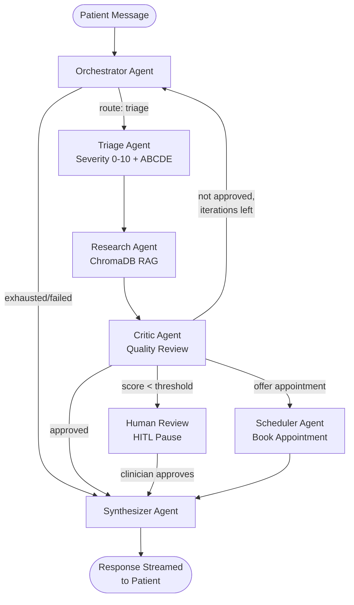

<](https://github.com/Sreethesh007/HackathonAiAgent/actions/workflows/ci.yml)
[](https://github.com/Sreethesh007/HackathonAiAgent/actions/workflows/frontend-ci.yml)


A production-grade AI triage system that coordinates six specialised LLM agents through a LangGraph pipeline to assess patient symptoms, retrieve evidence-based medical guidelines from a ChromaDB knowledge base, book appointments, and deliver clinician-reviewed recommendations — all with real-time SSE streaming and full observability.

</div>

---

## Table of Contents

- [Project Overview](#project-overview)
- [Architecture](#architecture)
- [Tech Stack](#tech-stack)
- [Repository Structure](#repository-structure)
- [Setup Instructions](#setup-instructions)
  - [Prerequisites](#prerequisites)
  - [Backend (Local Development)](#backend-local-development)
  - [Frontend (Local Development)](#frontend-local-development)
  - [Full Stack with Docker Compose](#full-stack-with-docker-compose)
  - [Local Models with llama.cpp](#local-models-with-llamacpp)
- [Environment Variables](#environment-variables)
- [Usage](#usage)
  - [Seeding the Knowledge Base](#seeding-the-knowledge-base)
  - [Generating JWT Tokens](#generating-jwt-tokens)
  - [API Endpoints](#api-endpoints)
  - [Example API Calls](#example-api-calls)
  - [Demo Scenarios](#demo-scenarios)
- [Testing](#testing)
- [CI/CD](#cicd)
- [Deployment](#deployment)
- [Observability](#observability)
- [Security Notes](#security-notes)
- [Troubleshooting](#troubleshooting)
- [Contributing](#contributing)
- [License](#license)

---

## Project Overview

Healthcare Triage Agent is an autonomous multi-agent system that triages patient symptoms using AI. A patient describes their symptoms through a chat-style interface, and the system orchestrates a pipeline of specialised agents to:

1. **Assess urgency** — classify severity (0–10) and urgency level (emergency / urgent / routine)
2. **Research guidelines** — retrieve relevant clinical protocols from a vector knowledge base (18+ built-in WHO/NICE/AHA guidelines + PDF ingestion)
3. **Quality-check** — a critic agent validates the assessment against safety criteria
4. **Book appointments** — for non-emergency cases, schedule follow-up care
5. **Synthesize response** — generate a patient-friendly, evidence-cited recommendation streamed in real-time
6. **Escalate when uncertain** — Human-in-the-Loop (HITL) pause for clinician review when confidence is below threshold

### Key Capabilities

| Feature | Description |
|---------|-------------|
| **Multi-Agent Pipeline** | 6 agents (Orchestrator → Triage → Research → Critic → Scheduler → Synthesizer) coordinated via LangGraph StateGraph |
| **Dual LLM Providers** | Switch between Anthropic Claude (cloud) and llama.cpp (local, zero-cost) with a single env var |
| **RAG Knowledge Base** | ChromaDB vector store with sentence-transformers embeddings (offline, no API key needed) |
| **Real-time Streaming** | Server-Sent Events (SSE) for token-by-token LLM output + agent step notifications |
| **Patient Dashboard** | Angular 21 chat interface with session history, appointment confirmations, and conversation persistence |
| **Clinician Dashboard** | Overview analytics, pending HITL reviews with approve/reject, appointment management |
| **Supabase Auth** | Email/password authentication with role-based routing (patient vs. clinician) |
| **HITL Safety Net** | Automatic escalation when critic quality score falls below configurable threshold |
| **Observability** | Prometheus metrics, structured logging (structlog), PII auto-redaction in production |
| **CI/CD** | GitHub Actions for backend tests + coverage, frontend build + Docker image verification |

---

## Architecture

### System Architecture Diagram

```
┌─────────────────────────────────────────────────────────────────────────┐
│                           FRONTEND (Angular 21)                        │
│  ┌──────────────┐  ┌─────────────────┐  ┌────────────────────────────┐ │
│  │ Landing Page  │  │  Patient Shell   │  │    Clinician Shell         │ │
│  │   (public)    │  │ ┌─────────────┐ │  │ ┌──────────┐ ┌──────────┐ │ │
│  │              │  │ │ Triage Chat  │ │  │ │ Overview │ │ Pending  │ │ │
│  │ Login/Signup │  │ │  (SSE stream)│ │  │ │Analytics │ │ Reviews  │ │ │
│  │ (Supabase)   │  │ └─────────────┘ │  │ └──────────┘ └──────────┘ │ │
│  └──────────────┘  └─────────────────┘  │ ┌──────────────────────┐   │ │
│                                          │ │   Appointments Mgmt  │   │ │
│                                          │ └──────────────────────┘   │ │
│                                          └────────────────────────────┘ │
└──────────────────────────────┬──────────────────────────────────────────┘
                               │ HTTP/SSE (Bearer JWT)
                               ▼
┌─────────────────────────────────────────────────────────────────────────┐
│                        BACKEND (FastAPI + LangGraph)                    │
│                                                                         │
│  ┌─── API Layer ────────────────────────────────────────────────────┐   │
│  │  POST /triage          → Start triage (SSE stream)              │   │
│  │  POST /triage/:id/continue → Continue / HITL approval (SSE)     │   │
│  │  GET  /sessions        → Patient session history                │   │
│  │  GET  /clinician/pending → Pending HITL reviews                 │   │
│  │  GET  /clinician/appointments → All appointments                │   │
│  │  GET  /health          → Liveness + provider info               │   │
│  │  GET  /metrics         → Prometheus metrics                     │   │
│  └──────────────────────────────────────────────────────────────────┘   │
│                                                                         │
│  ┌─── Agent Pipeline (LangGraph StateGraph) ────────────────────────┐  │
│  │                                                                   │  │
│  │  START → Orchestrator ──┬──→ Triage → Research → Critic ──┬──→   │  │
│  │                         │                                  │      │  │
│  │                         │    ┌──── [approved] ────────────┐│      │  │
│  │                         │    │                            ││      │  │
│  │                         │    ▼                            ▼│      │  │
│  │                         │  Scheduler ──→ Synthesizer ──→ END     │  │
│  │                         │                     ▲                   │  │
│  │                         │    [human review]   │                   │  │
│  │                         │    ▼                │                   │  │
│  │                         │  human_review ──────┘                   │  │
│  │                         │    (HITL pause)                         │  │
│  │                         │                                         │  │
│  │                         └── [needs retry] → Orchestrator (loop)   │  │
│  │                                                                   │  │
│  └───────────────────────────────────────────────────────────────────┘  │
│                                                                         │
│  ┌─── Data Layer ───────────────────────────────────────────────────┐   │
│  │  ChromaDB (vector store)  │  Supabase (auth, conversations,     │   │
│  │  all-MiniLM-L6-v2         │   appointments)                     │   │
│  │  18 built-in guidelines   │  SQLite (local conversation cache)  │   │
│  └───────────────────────────────────────────────────────────────────┘  │
└─────────────────────────────────────────────────────────────────────────┘
                               │
                               ▼
┌─────────────────────────────────────────────────────────────────────────┐
│                        OBSERVABILITY                                    │
│  Prometheus (scrapes /metrics every 15s) → Grafana Dashboards          │
│  structlog (JSON in prod, colourised in dev) → PII auto-redaction      │
└─────────────────────────────────────────────────────────────────────────┘
```

### Agent Pipeline Flow



### Frontend Architecture

```
frontend/src/app/
├── core/                       # Singleton services & guards
│   ├── guards/                 # authGuard, roleGuard
│   ├── interceptors/           # JWT interceptor (auto-attach Bearer token)
│   ├── models/                 # TypeScript interfaces
│   └── services/
│       ├── auth.service.ts     # Supabase auth + mock clinician bypass
│       ├── triage-api.service.ts  # SSE streaming + REST API client
│       └── notification.service.ts
├── features/                   # Lazy-loaded feature modules
│   ├── landing/                # Public landing page
│   ├── auth/                   # Login, signup, forgot/reset password
│   ├── patient/                # Patient shell + triage chat page
│   └── clinician/              # Clinician shell + overview, pending, appointments
├── shared/                     # Reusable components, pipes, directives, animations
├── app.routes.ts               # Standalone route config with lazy loading
├── app.config.ts               # Provider config (router, HTTP, charts, animations)
└── app.ts                      # Root component
```

---

## Tech Stack

### Backend

| Component | Technology |
|-----------|-----------|
| API Framework | FastAPI 0.111+ with async support |
| Agent Orchestration | LangGraph (StateGraph with MemorySaver checkpointing) |
| LLM Providers | Anthropic Claude (cloud) / llama.cpp via OpenAI-compat API (local) |
| Vector Store | ChromaDB with sentence-transformers (all-MiniLM-L6-v2, offline) |
| Auth | Supabase Auth (email/password) + JWT (HS256) for API auth |
| Database | Supabase (PostgreSQL) for conversations & appointments |
| Validation | Pydantic v2 with strict schemas |
| Rate Limiting | SlowAPI (configurable per-minute limits) |
| Structured Logging | structlog with PII auto-redaction in production |
| Metrics | prometheus-client (counters, histograms, gauges) |
| Resilience | tenacity retry policies, cachetools |

### Frontend

| Component | Technology |
|-----------|-----------|
| Framework | Angular 21 (standalone components, signals) |
| UI Library | Angular Material 21 + Angular CDK |
| Auth | Supabase JS SDK with session persistence |
| Charts | Chart.js + ng2-charts (clinician analytics) |
| Streaming | Fetch API with ReadableStream (SSE parsing) |
| Build | Angular CLI, AOT compilation, lazy-loaded routes |
| Styling | SCSS with custom design system |
| Testing | Vitest (unit), jsdom |
| Deployment | Docker (multi-stage: Node build → Nginx serve) |

### Infrastructure

| Component | Technology |
|-----------|-----------|
| Containerisation | Docker with multi-stage builds |
| Monitoring | Prometheus + Grafana |
| CI/CD | GitHub Actions (2 workflows: backend, frontend) |
| Deployment | Docker Compose (local), Vercel (frontend), Azure Web App (backend) |

---

## Repository Structure

```
healthcare-triage-agent/
├── .github/workflows/
│   ├── ci.yml                  # Backend: lint, test, coverage, Docker build
│   └── frontend-ci.yml         # Frontend: test, build, Docker image
├── src/                        # Python backend
│   ├── api/
│   │   ├── main.py             # FastAPI app, endpoints, SSE streaming
│   │   ├── auth.py             # JWT + Supabase token verification
│   │   ├── schemas.py          # Pydantic request/response models
│   │   └── conversation_store.py  # Supabase conversation persistence
│   ├── agents/
│   │   ├── orchestrator.py     # Plans and routes to next agent
│   │   ├── triage_agent.py     # ABCDE assessment, severity scoring
│   │   ├── research_agent.py   # RAG retrieval from ChromaDB
│   │   ├── scheduler_critic_agents.py  # Appointment booking + quality review
│   │   └── synthesizer.py      # Patient-facing response generation + HITL node
│   ├── graph/
│   │   └── pipeline.py         # LangGraph StateGraph wiring
│   ├── llm/
│   │   └── provider.py         # LLM factory (Anthropic / llama.cpp)
│   ├── memory/
│   │   └── retriever.py        # ChromaDB wrapper with LangChain interface
│   ├── tools/
│   │   └── clinical_tools.py   # Symptom lookup, severity scale, appointment booking
│   ├── observability/
│   │   ├── logging.py          # structlog config with PII redaction
│   │   └── metrics.py          # Prometheus counters/histograms/gauges
│   ├── agent_state.py          # Pydantic v2 shared state model
│   ├── config.py               # Pydantic settings (from .env)
│   ├── db.py                   # Supabase appointment database
│   └── utils.py                # Shared utilities
├── frontend/                   # Angular 21 SPA
│   ├── src/app/                # Application source
│   ├── Dockerfile              # Multi-stage (Node → Nginx)
│   ├── nginx.conf              # SPA routing + API reverse proxy
│   └── vercel.json             # Vercel SPA rewrite rules
├── monitoring/
│   └── prometheus.yml          # Scrape config (triage-agent + self)
├── scripts/
│   ├── seed_knowledge.py       # Seed ChromaDB with 18 clinical guidelines + PDFs
│   ├── check_env.py            # Environment sanity checker
│   ├── download_model.py       # GGUF model downloader for llama.cpp
│   └── migrate_to_supabase.py  # Migration helper
├── tests/
│   ├── test_all.py             # Full test suite (unit + integration, 500+ lines)
│   └── test_provider.py        # LLM provider tests
├── examples/
│   └── scenarios.py            # 3 demo scenarios (emergency, routine, HITL)
├── supabase-email-templates/   # Custom email templates for auth flows
├── data/                       # Runtime data (gitignored)
│   ├── chroma/                 # ChromaDB persistent storage
│   ├── sessions/               # Session state files
│   └── failed_flows/           # Failed pipeline state dumps
├── models/                     # GGUF model files (gitignored)
├── Makefile                    # 20+ automation targets
├── pyproject.toml              # Python project config + dependencies
├── .env.example                # Environment variable template
└── .gitignore
```

---

## Setup Instructions

### Prerequisites
- Python 3.11+
- Docker & Docker Compose (for full stack)
- Anthropic API key ([get one here](https://console.anthropic.com))

### Option A — Local Python (development)

```bash
# 1. Clone the repository
git clone https://github.com/Sreethesh007/HackathonAiAgent.git
cd HackathonAiAgent

# 2. Create and activate a virtual environment
python -m venv venv

# Windows
venv\Scripts\activate

# macOS/Linux
source venv/bin/activate

# 2. Install dependencies
make install

# 3. Configure environment
cp .env.example .env
# Edit .env — at minimum set: ANTHROPIC_API_KEY, JWT_SECRET, SUPABASE_URL, SUPABASE_KEY

# 4. Verify setup
make env-check

# 6. Seed the knowledge base (required on first run)
python scripts/seed_knowledge.py

# 6. Generate a dev JWT token
make token USER=dev-user
# → eyJhbGciOiJIUzI1NiJ9...

# 7. Start the API
make run-dev
# API → http://localhost:8000
# Docs → http://localhost:8000/docs
```

### Option B — Docker Compose (recommended for on-premise)

```bash
# 1. Navigate to the frontend directory
cd frontend

# 2. Copy and configure environment variables
cp .env.example .env
# Edit .env — set SUPABASE_URL and SUPABASE_KEY

# 3. Install dependencies
npm install

# 4. Start the Angular dev server (with API proxy to backend)
npm start
# This runs: npm run config && ng serve
# The `config` script generates environment.ts from .env
```

The frontend will be available at [http://localhost:4200](http://localhost:4200).

> **Proxy configuration**: During development, requests to `/api/*` are automatically proxied to `http://localhost:8000` (stripping the `/api` prefix) via `proxy.conf.json`. Ensure the backend is running.

### Full Stack with Docker Compose

```bash
# Start all services: API, ChromaDB, Prometheus, Grafana
docker compose up --build -d

# Or via Makefile:
make run-docker

# Services:
#   API          → http://localhost:8000
#   API Docs     → http://localhost:8000/docs
#   ChromaDB     → http://localhost:8001
#   Prometheus   → http://localhost:9090
#   Grafana      → http://localhost:3000  (admin / admin)

# 3. Seed knowledge base inside the container
docker compose exec app python scripts/seed_knowledge.py

# 4. Generate a JWT token
docker compose exec app python -c "
from src.api.auth import create_access_token
print(create_access_token('admin', role='clinician'))
"
```

---

## API Reference

All endpoints require `Authorization: Bearer <JWT>` header.

### Start a triage session

```bash
# Generate a dev token for user "alice"
make token USER=alice

# Or directly with Python:
python -c "from src.api.auth import create_access_token; print(create_access_token('alice'))"
```

**Clinician mock login** (frontend only): Use `clinician@gmail.com` / `clinician` to bypass Supabase auth and access the clinician dashboard with a mock token.

### API Endpoints

| Method | Endpoint | Auth | Description |
|--------|----------|------|-------------|
| `POST` | `/triage` | ✅ | Start new triage session (SSE stream) |
| `POST` | `/triage/{session_id}/continue` | ✅ | Continue session or submit HITL decision (SSE) |
| `GET` | `/triage/{session_id}/status` | ✅ | Inspect session state |
| `GET` | `/sessions` | ✅ | List all sessions for current patient |
| `POST` | `/api/conversations` | ✅ | Save a conversation message |
| `GET` | `/api/conversations/{session_id}` | ✅ | Get conversation history |
| `DELETE` | `/api/conversations/{session_id}` | ✅ | Delete conversation |
| `GET` | `/clinician/pending` | ✅ | Pending HITL reviews |
| `GET` | `/clinician/appointments` | ✅ | All booked appointments |
| `GET` | `/clinician/check-slot` | ✅ | Check appointment slot availability |
| `GET` | `/health` | ❌ | Liveness + readiness probe |
| `GET` | `/health/llm` | ✅ | Deep LLM provider health check |
| `GET` | `/health/knowledge` | ❌ | Knowledge base health check |
| `GET` | `/metrics` | ❌ | Prometheus metrics |
| `GET` | `/docs` | ❌ | Swagger UI |
| `GET` | `/redoc` | ❌ | ReDoc API docs |

### Example API Calls

#### Start a Triage Session (SSE Streaming)

```bash
# Get a token first
TOKEN=$(python -c "from src.api.auth import create_access_token; print(create_access_token('patient-001'))")

# Start triage — returns Server-Sent Events
curl -N -H "Authorization: Bearer $TOKEN" \
     -H "Content-Type: application/json" \
     -d '{"message": "I have severe chest pain radiating to my left arm and jaw. I am sweating and feeling nauseous."}' \
     http://localhost:8000/triage
```

**SSE event types:**
| Event Type | Description |
|------------|-------------|
| `step_start` | Agent node started (e.g., `triage`, `research`) |
| `thinking` | LLM tokens from non-synthesizer agents |
| `message` | LLM tokens from the synthesizer (final patient response) |
| `step_content` | Per-agent reasoning summary |
| `metadata` | Final session metadata (severity, urgency, appointment info) |
| `error` | Error message |

#### Continue a Session / Submit HITL Decision

```bash
# Follow-up message
curl -N -H "Authorization: Bearer $TOKEN" \
     -H "Content-Type: application/json" \
     -d '{"message": "The pain started 20 minutes ago", "patient_id": "patient-001"}' \
     http://localhost:8000/triage/{session_id}/continue

# Clinician approves HITL review
curl -N -H "Authorization: Bearer $TOKEN" \
     -H "Content-Type: application/json" \
     -d '{"human_approval": true}' \
     http://localhost:8000/triage/{session_id}/continue
```

#### Check System Health

```bash
curl http://localhost:8000/health
# {"status":"ok","version":"1.0.0","uptime_seconds":123,"environment":"development",
#  "pipeline_ready":true,"llm_provider":"anthropic","llm_model":"claude-sonnet-4-20250514"}

curl http://localhost:8000/health/knowledge
# {"status":"ok","document_count":18,"collection":"medical_guidelines",
#  "embedding_model":"all-MiniLM-L6-v2","embedding_provider":"sentence_transformers"}
```

### Demo Scenarios

Run three pre-built scenarios that exercise the full pipeline:

```bash
make run-scenarios
# Or: python examples/scenarios.py
```

| Scenario | Description | Expected Urgency | Key Flow |
|----------|-------------|-------------------|----------|
| **1. Emergency** | Chest pain + arm radiation + sweating | Emergency (9/10) | Orchestrator → Triage → Research → Critic → Synthesizer ("Call 112") |
| **2. Routine** | Blood pressure follow-up, stable readings | Routine (2/10) | Full pipeline + Scheduler books appointment |
| **3. Ambiguous (HITL)** | Persistent headaches with nausea | Urgent (5/10) | Pipeline pauses at human_review → simulated clinician approval → resumes |

---

## Testing

### Backend Tests

The test suite (`tests/test_all.py`, 500+ lines) covers:
- **AgentState** — instantiation, serialization, PII redaction, iteration guards
- **Clinical Tools** — symptom lookup, severity scaling, appointment booking
- **Triage Agent** — normal assessment, emergency override, LLM failure fallback
- **Research Agent** — vector store retrieval, fallback guidelines
- **Orchestrator** — routing logic, max iterations, failure handling
- **Critic Agent** — approval/rejection, safety misclassification detection, failure → HITL
- **Pipeline Integration** — end-to-end with mocked LLMs, session persistence, loop termination
- **Auth** — JWT creation, decoding, expiration handling

```bash
# Run full test suite with coverage
make test
# Or: pytest tests/ -v --tb=short --cov=src --cov-report=term-missing --cov-report=xml

# Run tests without coverage (faster)
make test-fast

# Watch mode (re-run on file changes, requires pytest-watch)
make test-watch
```

**Coverage target**: ≥40% enforced in CI, with individual module targets:
- `agent_state.py` → 100%
- `tools/clinical_tools` → 95%+
- `agents/*` → 85%+
- `graph/pipeline.py` → 80%+
- `api/*` → 80%+

### Frontend Tests

```bash
cd frontend

# Run unit tests (Vitest)
npm test
# Or: npx ng test --watch=false

# Production build validation
npx ng build --configuration production
```

### Code Quality

```bash
# Lint with ruff
make lint

# Auto-format with black + ruff
make format

# Type checking with mypy
make typecheck
```

---

## CI/CD

### Backend CI (`ci.yml`)

Triggers on push to `main`/`develop` and PRs to `main`.

1. **Setup** — Python 3.11, pip cache
2. **Install** — `pip install -e ".[dev]"`
3. **Lint** — `ruff check` (warn only)
4. **Test** — `pytest` with coverage (fail if < 40%)
5. **Coverage upload** — Codecov
6. **Docker build** — Verify `Dockerfile` builds (no push)

### Frontend CI (`frontend-ci.yml`)

Triggers on push to `main`/`develop` when `frontend/**` files change.

1. **Setup** — Node 20, npm cache
2. **Install** — `npm ci`
3. **Test** — `npx ng test --watch=false`
4. **Build** — Production AOT build
5. **Docker** — Build and tag Docker image
6. **Upload** — Store `dist/` as artifact (7-day retention)

---

## Deployment

### Frontend Production Build

```bash
cd frontend

# AOT-compiled, tree-shaken, minified build
npx ng build --configuration production

# Output: frontend/dist/
```

The production build includes:
- **AOT compilation** — faster rendering, smaller bundles
- **Lazy-loaded routes** — patient, clinician, auth modules loaded on demand
- **Tree shaking** — unused code eliminated
- **Gzip** — served by Nginx with gzip compression

### Docker Deployment

**Frontend Dockerfile** (multi-stage):
```dockerfile
# Stage 1: Build with Node 20
FROM node:20-alpine AS builder
# Stage 2: Serve via Nginx 1.27
FROM nginx:1.27-alpine AS runtime
```

**Backend**: Reference the root `Dockerfile` for the API container.

### Docker Compose (Full Stack)

```bash
docker compose up --build -d
```

Services:
- `app` — FastAPI backend on port 8000
- `chromadb` — ChromaDB on port 8001
- `prometheus` — Metrics collection on port 9090
- `grafana` — Dashboard on port 3000

### Vercel (Frontend Only)

The frontend includes a `vercel.json` for Vercel deployment:

```json
{
  "rewrites": [{ "source": "/(.*)", "destination": "/index.html" }]
}
```

Set `SUPABASE_URL` and `SUPABASE_KEY` in Vercel environment variables.

### Azure Web App for Containers

1. Push Docker images to Azure Container Registry (ACR)
2. Create an Azure Web App for Containers pointing to the ACR image
3. Configure environment variables in the App Service configuration:
   - All variables from `.env.example`
   - Set `ENVIRONMENT=production` for JSON logging + PII redaction
   - Set `CORS_ORIGINS` to your frontend domain

---

## Observability

### Prometheus Metrics

The API exposes metrics at `GET /metrics` in Prometheus text format.

#### Available Metrics

| Metric | Type | Labels | Description |
|--------|------|--------|-------------|
| `agent_calls_total` | Counter | `agent`, `status` | Total agent invocations |
| `agent_latency_seconds` | Histogram | `agent` | Agent call duration |
| `tool_calls_total` | Counter | `tool`, `status` | Total tool invocations |
| `active_sessions` | Gauge | — | In-progress triage sessions |
| `human_reviews_requested_total` | Counter | — | Sessions routed to HITL |
| `flow_completions_total` | Counter | `urgency_level` | Completed triage flows |
| `flow_failures_total` | Counter | `reason` | Failed triage flows |
| `api_requests_total` | Counter | `method`, `endpoint`, `status_code` | HTTP requests |
| `api_request_latency_seconds` | Histogram | `endpoint` | HTTP latency |
| `llm_tokens_total` | Counter | `agent`, `token_type` | LLM token usage |

### Prometheus Configuration

```yaml
# monitoring/prometheus.yml
global:
  scrape_interval: 15s

scrape_configs:
  - job_name: "triage-agent"
    static_configs:
      - targets: ["app:8000"]
    metrics_path: /metrics
```

### Grafana Dashboards

After starting Grafana (via Docker Compose at [http://localhost:3000](http://localhost:3000)), add Prometheus as a data source (`http://prometheus:9090`) and create dashboards.

#### Example PromQL Queries

```promql
# Request rate by endpoint (last 5 minutes)
rate(api_requests_total[5m])

# 95th percentile API latency
histogram_quantile(0.95, rate(api_request_latency_seconds_bucket[5m]))

# Active sessions gauge
active_sessions

# Agent call error rate
rate(agent_calls_total{status="error"}[5m])
/ rate(agent_calls_total[5m])

# Triage flow completions by urgency level
sum by (urgency_level) (flow_completions_total)

# LLM token consumption by agent
sum by (agent) (rate(llm_tokens_total[1h]))

# Human review escalation rate
rate(human_reviews_requested_total[1h])
```

### Structured Logging

- **Development**: Colourised, human-readable console output (structlog `ConsoleRenderer`)
- **Production** (`ENVIRONMENT=production`): JSON format with automatic PII redaction
  - Fields `patient_id`, `current_input`, `message_content`, `patient_name` are SHA-256 hashed

---

## Security Notes

### Authentication & Authorization

- **Supabase Auth** handles user registration, login, password reset, and email verification
- **JWT tokens** are validated against Supabase on every API request (not decoded locally in production)
- **Role-based routing**: `authGuard` + `roleGuard` enforce patient vs. clinician access on the frontend
- **Mock clinician bypass**: `clinician@gmail.com` / `clinician` is available for development only — disable in production

### JWT Best Practices

- **Rotate `JWT_SECRET`** regularly in production — use a cryptographically random string ≥ 256 bits
- **Short expiration**: Default 60 minutes (`JWT_EXPIRE_MINUTES`), reduce for sensitive deployments
- **No secrets in tokens**: Tokens contain only `sub`, `role`, `exp` — no PII

### PII Handling

- All PII fields in `AgentState` are clearly marked with `⚠ PII` comments
- Production logging auto-redacts `patient_id`, `current_input`, `message_content`, `patient_name` via SHA-256 hashing
- `safe_log_dict()` method provides a fully redacted state snapshot for debugging
- Conversation data is stored in Supabase with row-level security (RLS) recommended

### Network Isolation

- CORS origins are explicitly configured (`CORS_ORIGINS` env var) — no wildcard `*` in production
- Rate limiting via SlowAPI: configurable per-minute limit per IP address
- Nginx security headers in production: `X-Content-Type-Options: nosniff`, `X-Frame-Options: DENY`, `Referrer-Policy: strict-origin-when-cross-origin`
- API proxy in Nginx strips the `/api` prefix — backend is not directly exposed

### Rate Limiting

- Default: 10 requests per minute per IP on triage endpoints
- Configure via `RATE_LIMIT_PER_MINUTE` environment variable
- Returns `429 Too Many Requests` with retry-after header

### Additional Recommendations

- Enable Supabase Row Level Security (RLS) on `conversations` and `appointments` tables
- Use HTTPS in production (terminate TLS at load balancer or Nginx)
- Store GGUF model files outside the web-accessible directory
- Never commit `.env` files — `.gitignore` is pre-configured to exclude them

---

## Troubleshooting

### Environment Configuration

| Problem | Solution |
|---------|----------|
| `.env` file not found | `cp .env.example .env` and fill in values |
| `ANTHROPIC_API_KEY` missing | Get a key at [console.anthropic.com](https://console.anthropic.com) |
| `Invalid LLM configuration` on startup | Run `python scripts/check_env.py` to diagnose |
| `JWT_SECRET` is placeholder | Set a random string: `python -c "import secrets; print(secrets.token_urlsafe(32))"` |

### ChromaDB Issues

| Problem | Solution |
|---------|----------|
| `knowledge_base_empty` warning | Run `python scripts/seed_knowledge.py --reset` |
| `ChromaDB PersistentClient` errors | Ensure `./data/chroma/` exists and is writable |
| `sentence-transformers not installed` | `pip install sentence-transformers` |
| Embedding dimension mismatch after model change | `python scripts/seed_knowledge.py --reset` (deletes and recreates collection) |

### llama.cpp Issues

| Problem | Solution |
|---------|----------|
| Server not reachable | Ensure llama-server is running: `make check-llamacpp` |
| Slow inference | Reduce `LLAMACPP_N_CTX`, increase `LLAMACPP_N_THREADS`, try a smaller quantised model |
| Out of memory | Use a smaller model (e.g., `phi-3-mini-4k-instruct.Q4_K_M.gguf` for 3 GB RAM) |
| Model not found | `python scripts/download_model.py --list` to see available models |

### Docker Issues

| Problem | Solution |
|---------|----------|
| Port 8000 already in use | Stop conflicting services or change `API_PORT` in `.env` |
| Port 3000 conflict (Grafana) | Change the port mapping in `docker-compose.yml` |
| Build fails on ARM | Ensure Docker Buildx is enabled: `docker buildx create --use` |
| ChromaDB container won't start | Check volume permissions: `chmod -R 777 ./data/chroma` |

### Frontend Issues

| Problem | Solution |
|---------|----------|
| `Cannot connect to /api/*` | Ensure backend is running on port 8000; check `proxy.conf.json` |
| Supabase auth errors | Verify `SUPABASE_URL` and `SUPABASE_KEY` in `frontend/.env` |
| CORS errors | Add frontend URL to `CORS_ORIGINS` in backend `.env` |
| SSE stream disconnects | Check for firewall/proxy timeout settings; increase `proxy_read_timeout` |
| `environment.ts` has wrong values | Re-run `npm run config` (reads from `frontend/.env`) |

### API & Auth Issues

| Problem | Solution |
|---------|----------|
| `401 Invalid or expired token` | Re-authenticate via Supabase; check token expiration |
| `429 Too Many Requests` | Wait or increase `RATE_LIMIT_PER_MINUTE` |
| `503 Pipeline not ready` | Backend is still initializing — wait for startup logs |
| SSE events not arriving | Ensure `Accept: text/event-stream` header; check firewall/proxy buffering |

---

## Contributing

Contributions are welcome! Please follow these guidelines:

1. **Fork** the repository and create a feature branch from `develop`
2. **Install dev dependencies**: `pip install -e ".[dev]"` and `cd frontend && npm install`
3. **Run tests** before submitting: `make test` and `cd frontend && npm test`
4. **Lint and format**: `make lint && make format`
5. **Write tests** for new functionality (maintain ≥40% coverage)
6. **Open a Pull Request** against `main` with a clear description

### Development Commands

```bash
make help              # Show all available targets
make install           # Install all dependencies
make env-check         # Verify environment
make run-dev           # Start API with hot-reload
make test              # Run tests with coverage
make test-fast         # Run tests without coverage
make lint              # Run ruff linter
make format            # Auto-format with black + ruff
make typecheck         # Run mypy
make seed-knowledge    # Seed vector store
make token USER=alice  # Generate a dev JWT
make run-scenarios     # Run demo scenarios
make export-graph      # Export pipeline diagram to docs/graph.md
make clean             # Remove generated files and caches
```

### Language Breakdown

| Language | Percentage |
|----------|-----------|
| Python | ~55% |
| TypeScript | ~30% |
| HTML/SCSS | ~10% |
| YAML/Config | ~5% |

---

<div align="center">

[FastAPI](https://fastapi.tiangolo.com/) · [LangGraph](https://langchain-ai.github.io/langgraph/) · [Angular](https://angular.dev/) · [ChromaDB](https://www.trychroma.com/) · [Supabase](https://supabase.com/)

</div>
]]>
